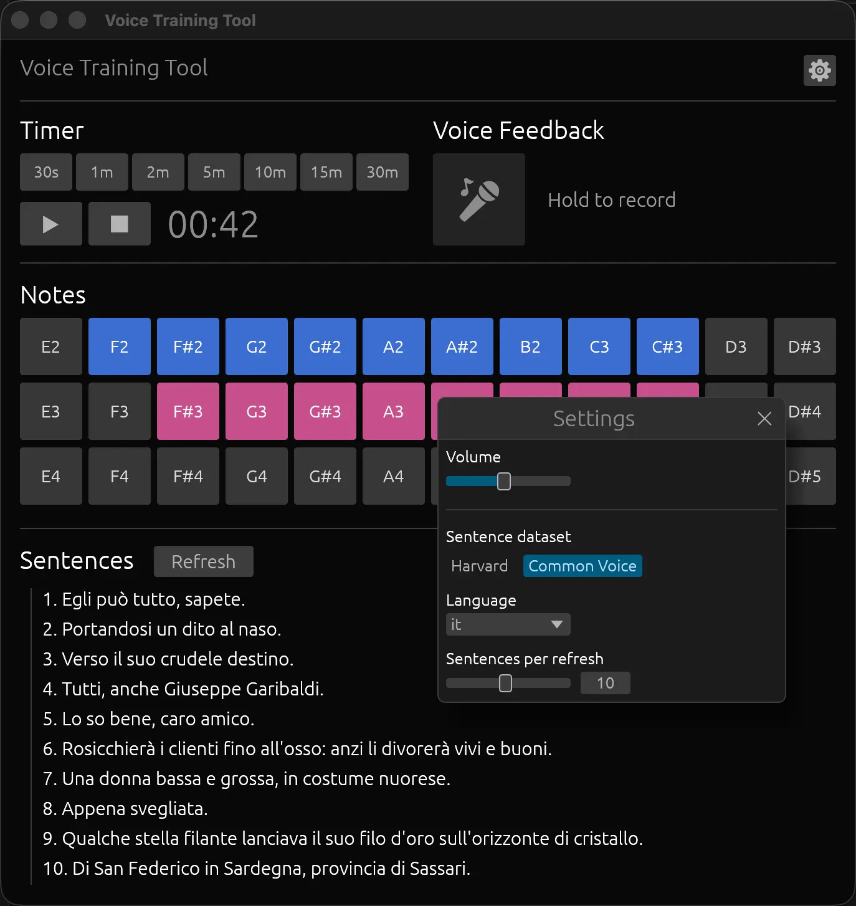

#  Voice Training Tool

A desktop app for voice training practice, built with Rust and egui. Runs on macOS, Linux, and Windows. Tailored for the [Pitch Naturalisation](https://wiki.sumianvoice.com/wiki/pages/PIPM/) method developed by [Sumi](https://sumianvoice.com/#).



## Features

- **Timer** — preset durations (30s, 1m, 2m, 5m, 10m, 15m, 30m) with pause/resume and stop controls
- **Note buttons** — 36 notes across three octaves (E2–D#5), producing a square wave tone while held; displays the note's frequency in Hz
- **Sentences** — reading practice sentences, choose between:
  - *Harvard sentences* — phonetically balanced English sentences
  - *Common Voice* — sentences in 100+ languages from the [Mozilla Common Voice](https://commonvoice.mozilla.org/) dataset

## Requirements

- Rust
- `rsvg-convert` for generating the `.icns` app icon: `brew install librsvg`

## Building

```sh
./bundle.sh
```

This compiles a release build and produces `build/Voice Training Tool.app`.
